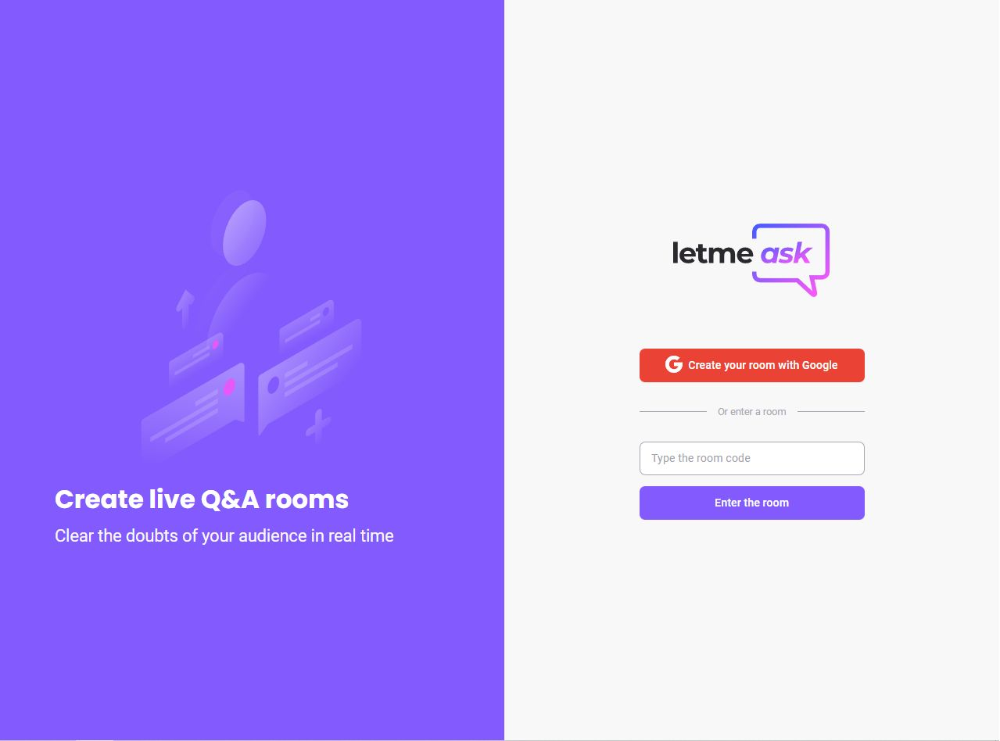

 
 

# Letmeask | Q&A rooms (broken)

 

> Project made together with Rockeseat to practise Next.js and Firebase.

| Status | Project |
| --- | --- |
|  | [Site](https://letmeask-nlw6-react.vercel.app) |
 

## :pushpin: About

This project was developed together with [Rocketseat](https://github.com/Rocketseat) and [Diego Fernandes](https://github.com/diego3g) in NLW #6 in order to practise web development using Next.js and Firebase to provide real-time rooms. **Currently this project is broken** and I don't know how to fix it, so I decided to build a new one, which you can see [here](https://github.com/SlyCooper-n/onlyrooms).
> For more information about my dev journey, consider visiting my [LinkedIn](https://linkedin.com/in/gabriel-vs-frasao).

## :hammer: Main tools and libs used

Base tools

- [Next.js](https://nextjs.org/)
- [Firebase](https://firebase.google.com/)
- [TypeScript](https://www.typescriptlang.org/)

Styling

- [Tailwind](https://tailwindcss.com/)

Linters and Formatters

- [ESLint](https://eslint.org/)
- [Prettier](https://prettier.io/)
- [.editorConfig](https://editorconfig.org/)

## :sparkles: Features

- [x] Real-time rooms
- [x] PWA support
- [x] Theme based on device system

### :eye: Curious to see what's coming next?

[Stay tuned right here](https://github.com/users/SlyCooper-n/projects/3)

## :brain: Thinking of contributing to the project?

Clone the repo as shown above :arrow_up: and follow [this little guide](https://github.com/SlyCooper-n/letmeask-nlw6-react/blob/main/_docs/CONTRIBUTING.md)

## :memo: License

[MIT License](https://github.com/SlyCooper-n/letmeask-nlw6-react/blob/main/LICENSE) &copy; [Gabriel VS Frasão](https://github.com/SlyCooper-n)
